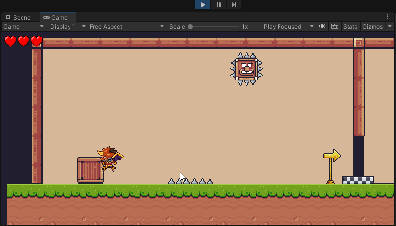

# Pandemonium-Platformer-game_Unity

- 2D player movement  
- Animation  
- Jump: 
   + Nhảy bám tường 
   + Nhảy cao thấp tùy vào việc nhấn giữ nút nhảy 
   + Delay khi vừa rời khỏi mặt phẳng để có thể nhảy tiếp (coyote time) 
   + Double jump 
- Shooting, projectile 
- Enemy cận chiến, đánh xa dùng cast, enemy tuần tra 
- Health system 
- Player bất tử khi vừa chịu sát thương 
- Audio 
- Checkpoint, respawn when die 
- Gameover screen 
- Pause game, pause screen, option setting 

